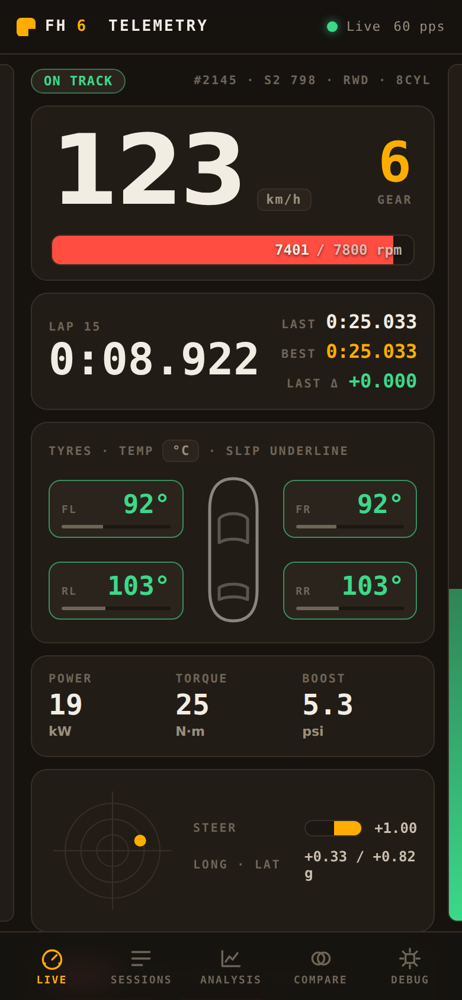
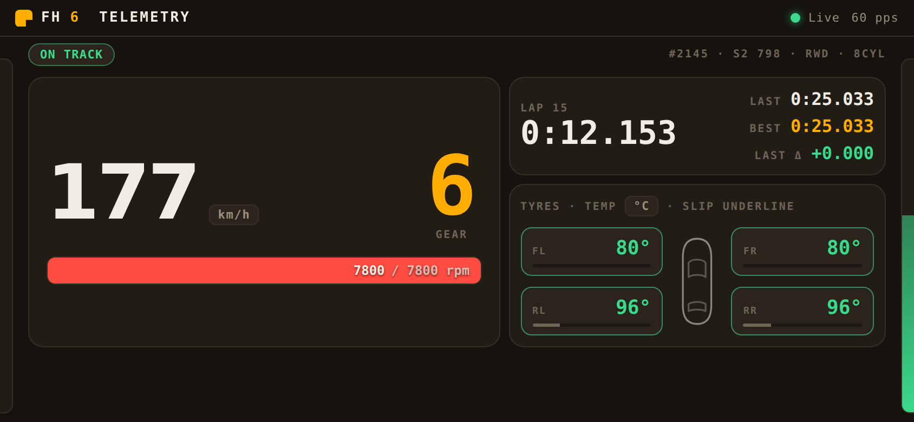
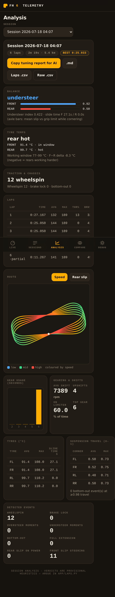

# Forza Horizon 6 Telemetry


A self-hosted telemetry collector and **mobile pit instrument** for **Forza
Horizon 6**. It listens for Forza's "Data Out" UDP stream, parses every field
of the **324-byte FH6 packet** (layout validated against the real game), shows
a live dashboard on your phone, records every session to disk, breaks them
into **laps with tuning-grade stats**, and exports an **AI-ready tuning
report** you can paste straight into Claude or ChatGPT — or let Claude query
directly over **MCP**. All on your own Wi-Fi, **no cloud, no external
dependencies**.

Runs two ways: as a **Docker container**, or as a **single double-click
`.exe`** on Windows (no Python, no Docker). There's also a built-in **synthetic
generator**, so you can try the whole thing right now without a console.

```
Xbox / PC  ──UDP 9876──▶  collector  ──HTTP/WebSocket 8080──▶  Phone (same Wi-Fi)
(Data Out)               (this app)                            (dashboard PWA)
```

| Live (phone) | Landscape mount | Analysis |
| --- | --- | --- |
|  |  |  |

The live view is built like an instrument, not a website: huge tabular
numerals that never shift layout, tyre pods coloured by the **temperature
window** (blue cold → green in-window → amber hot → red over), and the
signature **edge pedal ribbons** — brake on the left edge of the screen,
throttle on the right — readable in peripheral vision while you drive.

### 🎮 Just want to run it? (Windows)

**[⬇️ Download fh6-telemetry.exe](https://github.com/ClickClickMedia/Forza-6-telemetry/releases/latest/download/fh6-telemetry.exe)** — one file, double-click, done. No Docker, no Python, no install.
→ Full steps: **[Download & run (Windows)](#download-and-run-on-windows-easiest)**.

> ### 📡 Packet layout: empirically validated against the real game
>
> The parser uses the layout **confirmed against live FH6 captures**
> (2026-07-18): FH6 emits the same 324-byte "Horizon" packet as FH4/FH5.
> The validation is a physics cross-check anyone can reproduce on the
> **`/debug`** page: the dash `Speed` field must equal the sled
> `|VelocityX,Y,Z|` magnitude — they matched to 3 decimal places on every
> captured frame, tyre temps decoded to the plausible 180–230 °F band, and
> `DistanceTraveled`/`CurrentRaceTime` advanced monotonically. If a value ever
> looks wrong on your setup, [open an issue](../../issues/new/choose) with a
> `/debug` screenshot — field definitions live in one place
> ([`app/packet.py`](app/packet.py)) and every offset is pinned by unit tests.

## Features

- **UDP receiver** — asyncio `DatagramProtocol` bound to `0.0.0.0:9876`.
  Accepts only 324-byte packets, parses the FH6 field order (little-endian, see
  [the packet section](#the-fh6-packet-324-bytes)), and never crashes on
  malformed input. Tracks packets/sec, invalid/dropped packets and last-packet
  time.
- **Live pit instrument** — installable PWA with portrait, landscape-mount
  and desktop layouts, auto-reconnecting WebSocket, Wake Lock. Built for
  glanceability: fixed-width tabular numerals (zero layout shift), per-channel
  EMA smoothing on noisy values (tyre temps settle over ~1 s instead of
  strobing), a drift-corrected lap clock that ticks smoothly between packets,
  and pedal ribbons on the screen edges. Respects `prefers-reduced-motion`.
- **Recording** — auto-starts a session when `IsRaceOn` becomes 1, auto-ends
  after 5 s of silence, plus manual Start/Stop/Marker controls. Raw frames are
  stored with monotonic receive timestamps as CSV (or Parquet). Session
  metadata in SQLite. Rename, annotate, and download everything from the phone.
- **Laps & tuning stats** — sessions are segmented into laps with the numbers
  a tuner actually reads: tyre temps (°C) per corner with front/rear balance,
  a drift-aware **understeer index** (opposite-lock frames excluded), slide
  times per axle, wheelspin/brake-lock events, suspension travel usage and
  bottom-outs, shift RPM and time-on-limiter.
- **AI tuning export** — one tap copies a Markdown tuning report (car, laps,
  verdicts, a fill-in section for your current setup, and an analysis prompt)
  ready to paste into **Claude** or **ChatGPT**; or download `.md` / per-lap
  `.csv` / raw `.csv`.
- **MCP server** — `python -m app.mcp_server` (or `fh6-telemetry.exe --mcp`)
  lets Claude Desktop / Claude Code query your sessions and tuning reports
  directly. See [Connect Claude](#connect-claude-mcp).
- **Analysis & comparison** — per-session analysis with balance/temperature
  verdict cards, route trace coloured by speed or rear slip, gear usage, event
  detection; two-session channel overlay and route comparison.
- **Operations** — `/health` and `/api/status` endpoints, structured JSON
  logging, graceful shutdown, a packet-debug page with a live physics
  cross-check (`Speed` vs `|Velocity|`), automatic **v1.0.x recording
  rescue**, and a synthetic telemetry generator so you can test everything
  without an Xbox.

---

## Tune your car with AI

The point of collecting all this data: getting concrete setup changes out of
it. The workflow:

1. **Drive.** Laps in an event give the richest data (lap times populate);
   free roam works too. Recording is automatic.
2. Open **Sessions → Export → "Copy tuning report"** (or the same button on
   the Analysis page). You get a Markdown report with your laps, tyre temps,
   balance verdict, traction events, suspension usage and gearing — plus a
   fill-in block for your current setup values (telemetry can't see spring
   rates or pressures) and an analysis prompt.
3. **Paste it into Claude or ChatGPT.** The prompt tells the model exactly
   how to read the numbers and to propose changes within Forza's tuning
   screen (pressures, gearing, alignment, ARBs, springs, damping, aero,
   diff, brakes).
4. Apply the tune, drive again, and **Compare** the two sessions.

The verdicts (understeer/oversteer, temperature window) are computed from
grip-driving frames only — sustained drifting and opposite-lock moments are
excluded and reported separately, so a skid-pan session doesn't read as
"understeer". The tyre window is community-calibrated (optimal 88–99 °C,
usable 77–121 °C). Thresholds live in [`app/laps.py`](app/laps.py) as
documented constants; calibration PRs welcome.

**What this tool won't pretend to know:** Forza's Data Out carries no tyre
pressures and a single temperature per tyre (the inner/middle/outer readout
is the in-game HUD only — it is not in the UDP stream). Verdicts here use
only channels that actually exist; pressure and camber advice comes from the
setup values you fill into the report.

### Telemetry quirks worth knowing

- **Lap fields populate only in timed events** (races, Rivals, Time Trial).
  Free roam records fine, but shows as one "stint" with no lap markers.
- **Time Trial reports no `RacePosition`** — sessions key off `IsRaceOn`
  and the lap clock, never position.
- **Rewinds don't rewind telemetry**: the stream keeps flowing and your
  pre-rewind laps stay in the data; the analyser tolerates the time
  discontinuity.
- **Xbox sleep or app-switching kills Data Out** and it won't resume until
  Forza is restarted — if `pps` drops to 0 mid-session, that's usually why.

### Connect Claude (MCP)

Instead of copy-paste, let Claude read your telemetry directly. With the
collector running:

**Claude Code:**

```bash
claude mcp add fh6-telemetry -- python -m app.mcp_server
```

**Claude Desktop** (`claude_desktop_config.json`) — works with the Windows
exe, no Python needed:

```json
"fh6-telemetry": {
  "command": "C:\\path\\to\\fh6-telemetry.exe",
  "args": ["--mcp"],
  "env": { "FH6_URL": "http://127.0.0.1:8080" }
}
```

Then ask: *"List my FH6 sessions"*, *"Pull the tuning report for my latest
session and suggest setup changes"*, *"Is the game connected right now?"*
Tools exposed: `get_live_status`, `list_sessions`, `get_session_laps`,
`get_tuning_report`, `get_session_analysis`. The MCP server is a thin
read-only proxy over the local HTTP API — it never modifies your data.

---

## The FH6 packet (324 bytes)

**Forza Horizon 6 emits the same 324-byte "Horizon" packet as FH4/FH5** —
confirmed empirically against live game captures, not assumed. Every offset is
covered by unit tests ([`tests/test_packet.py`](tests/test_packet.py)):

| Property | FM7 "Dash" | Forza Motorsport (2023) | **FH4 / FH5 / FH6 (this app)** |
| --- | --- | --- | --- |
| Packet size | 311 | 331 | **324** |
| `TireWear` (4×f32) | absent | present | **absent** |
| `TrackOrdinal` (s32) | absent | present | **absent** |
| Horizon 12-byte block after `NumCylinders` | absent | absent | **present** |

The Horizon layout is the FM7 structure with two additions:

- **12 bytes inserted at offsets 232–243** (between `NumCylinders` and
  `PositionX`): the officially documented FH6 fields `CarGroup` (s32, a
  stable per-car category value), `SmashableVelDiff` and `SmashableMass`
  (f32 impact metadata, 0.0 outside collisions). Most FH5-era parsers still
  label these bytes "unknown"; v1.0.x of this project had the *names* right
  but modelled them as a 13-byte block with a pad byte — the one-byte error
  that corrupted the entire dash tail.
- **1 trailing byte at offset 323** (`Unknown3`, always observed 0).

So: **232-byte sled + 12-byte Horizon block + 79-byte dash tail (at 244) +
1 trailing byte = 324**. See the module docstring in
[`app/packet.py`](app/packet.py) for the authoritative field table and the
full validation story.

Wire units worth knowing: `Speed` m/s · `Power` watts · `TireTemp*`
**Fahrenheit** (the dashboard converts to °C) · `Boost` PSI · lap times
seconds. All scalars are decoded **little-endian**, validated by round-trip
and explicit endianness unit tests.

> **Recorded sessions with v1.0.0?** v1.0.x used a mis-specified layout that
> corrupted the dash-tail columns (speed, temps, laps, inputs) in recordings.
> v1.1 detects those files at startup and **rescues them automatically** —
> losslessly re-decoding the original bytes (originals kept as `*.v1bak`) and
> validating every frame with the same physics cross-check. Or run it
> manually: `python -m app.rescue --data-dir ./data`.

---

## Quick start (Docker)

> **On Windows and just want it running?** Grab the
> **[.exe](#download-and-run-on-windows-easiest)** instead — no Docker needed. This
> section is the container path (great for Linux or a home server). Step 1 below
> (enabling Data Out) applies either way.

### 1. Enable Data Out on the Xbox / PC

In **Forza Horizon 6**:

1. **Settings → HUD and Gameplay → Data Out** (sometimes under *Telemetry*).
2. Set **Data Out** = **ON**.
3. Set **Data Out IP Address** = the **IP of your Docker host** (e.g.
   `192.168.1.50`). Find it with `ip addr` (Linux) or `ipconfig` (Windows).
4. Set **Data Out IP Port** = **9876**.

The Xbox and the Docker host must be on the **same local network**.

### 2. Start the collector

```bash
git clone <this-repo> Forza-6-telemetry
cd Forza-6-telemetry
docker compose up -d --build
```

This publishes `9876/udp` (telemetry in) and `8080/tcp` (dashboard) and
persists data to `./data`.

### 3. Open the dashboard on your phone

On a phone connected to the **same Wi-Fi**, browse to:

```
http://<docker-host-ip>:8080
```

e.g. `http://192.168.1.50:8080`. Drive in-game and the dashboard comes alive.
Use your browser's **"Add to Home Screen"** to install it as a PWA.

### 4. Test without an Xbox (synthetic mode)

No console handy? Run the built-in generator, which emits real 324-byte FH6
packets to the UDP port:

```bash
# One-off: flip the compose env var and restart
FH6_SYNTHETIC=1 docker compose up -d
# ...or run the generator standalone against a running collector:
python -m app.synthetic --host 127.0.0.1 --port 9876 --hz 60
```

Set `FH6_SYNTHETIC=0` again to go back to real telemetry.

---

## Download and run on Windows (easiest)

**[⬇️ Download fh6-telemetry.exe](https://github.com/ClickClickMedia/Forza-6-telemetry/releases/latest/download/fh6-telemetry.exe)**
&nbsp; *(from the latest [Release](https://github.com/ClickClickMedia/Forza-6-telemetry/releases))*

This is a **single self-contained file** — the server and dashboard are bundled
inside it. You do **not** need Docker, Python, or WSL. Just download and run.

1. **Download** `fh6-telemetry.exe` (link above) and put it in its own folder,
   e.g. `Documents\FH6`. Recordings are saved to a `data\` folder next to it.
2. **Double-click it.** Windows may show a blue *"Windows protected your PC"*
   box because the app isn't code-signed — click **More info → Run anyway**.
   (It's open source; you can read every line in this repo.)
3. A **console window** opens and prints your addresses, e.g.:
   ```
   Dashboard (phone) : http://192.168.1.50:8080
   Forza Data Out    : send UDP to 192.168.1.50 : 9876
   ```
4. If Windows pops up a **firewall prompt**, tick **Private networks** and click
   **Allow access**. (No prompt? Open the ports once — see
   [Firewall notes](#firewall-notes).)
5. In **Forza Horizon 6**: **Settings → HUD and Gameplay → Data Out → ON**, set
   the **IP** to the address the console printed, and **Port** to **9876**.
6. On your **phone** (same Wi-Fi), open `http://<that-ip>:8080`. Drive, and the
   dashboard comes alive. Use **Add to Home Screen** to install it as an app.

To **stop**, close the console window (it shuts down cleanly). Recordings stay in
the `data\` folder for next time.

> **Try it without an Xbox first (optional):** open **PowerShell** in the exe's
> folder and run:
> ```powershell
> $env:FH6_SYNTHETIC = "1"; .\fh6-telemetry.exe
> ```
> A simulated car will drive the dashboard so you can see everything working.
> Close the window and double-click normally when you're ready for real data.

<details>
<summary>Other ways to get the exe (build it yourself, or an ad-hoc CI build)</summary>

The exe is built automatically on a Windows runner by GitHub Actions
(`.github/workflows/build-windows-exe.yml`).

- **Ad-hoc build without a Release:** open the **Actions** tab → **Build Windows
  executable** → **Run workflow**, then download the `fh6-telemetry-windows`
  artifact (a zip containing the exe).
- **Build it locally** (needs Python 3.12 on Windows once):
  ```powershell
  pip install -r requirements-exe.txt
  pyinstaller --clean --noconfirm fh6-telemetry.spec
  # -> dist\fh6-telemetry.exe
  ```

The exe uses **CSV** raw storage (the optional Parquet backend is Docker-only,
to keep the binary small) and honours the same `FH6_*`
[environment variables](#configuration).
</details>

---

## Alternative: run with Docker

> Most Windows users should use the **[.exe above](#download-and-run-on-windows-easiest)** —
> it's simpler and needs nothing installed. Docker is handy if you're on
> **Linux**, already run containers, or want the Parquet storage backend. It
> runs the exact same app.

### Docker on Windows (Docker Desktop)

Step-by-step for a Windows PC with **Docker Desktop** installed. Commands are
shown for **PowerShell**; notes call out where **WSL** differs. This assumes
Docker Desktop is running (the default WSL2 backend is fine).

### 1. Verify Docker is ready

```powershell
docker version
docker compose version
```

Both should print versions with no error. If `docker` isn't found, start
**Docker Desktop** and wait for the whale icon to report "running".

### 2. Get the code

```powershell
cd $HOME
git clone https://github.com/ClickClickMedia/Forza-6-telemetry.git
cd Forza-6-telemetry
```

> **WSL:** identical, but clone into the Linux filesystem (`~/`) rather than
> `/mnt/c/...` for much faster bind-mount performance.

### 3. Build and start

```powershell
docker compose up -d --build
```

The first build takes a few minutes. When it finishes:

```powershell
docker compose ps                                  # should show "running"
Invoke-RestMethod http://localhost:8080/health     # PowerShell-friendly
```

You should see `status : ok` and `packet_size : 324`.

> **WSL / cmd:** use `curl http://localhost:8080/health` instead of
> `Invoke-RestMethod`.

### 4. Test it works — before touching the Xbox

Run the built-in synthetic generator to confirm the dashboard end-to-end. Drop
a small override file into the project folder:

```powershell
@'
services:
  fh6-telemetry:
    environment:
      FH6_SYNTHETIC: "1"
'@ | Set-Content docker-compose.override.yml

docker compose up -d          # picks up the override automatically
```

Open **http://localhost:8080** in your PC browser — you should see a car
lapping. Check `/debug` too: it should show `received size 324`.

When you're ready for real telemetry, remove the override and restart:

```powershell
Remove-Item docker-compose.override.yml
docker compose up -d
```

### 5. Find your PC's LAN IP (for the phone and Xbox)

```powershell
ipconfig
```

Under your active **Wi-Fi** (or Ethernet) adapter, read the **IPv4 Address**,
e.g. `192.168.1.50` — that's your `<HOST-IP>`.

> With Docker Desktop the published ports live on the **Windows host IP** — use
> this address, not any `172.x` WSL/Docker address.

### 6. Open the Windows firewall

Run PowerShell **as Administrator**:

```powershell
New-NetFirewallRule -DisplayName "FH6 Telemetry UDP" -Direction Inbound -Protocol UDP -LocalPort 9876 -Action Allow
New-NetFirewallRule -DisplayName "FH6 Dashboard TCP" -Direction Inbound -Protocol TCP -LocalPort 8080 -Action Allow
```

If Windows prompts that "Docker Desktop Backend wants to accept connections",
click **Allow**.

### 7. Turn on Data Out in Forza Horizon 6

On the Xbox (or the PC running FH6):

1. **Settings → HUD and Gameplay → Data Out** → **ON**
2. **Data Out IP Address** → your `<HOST-IP>` from step 5.
   (If FH6 runs on the **same PC** as Docker, use `127.0.0.1`.)
3. **Data Out IP Port** → **9876**

The Xbox and PC must be on the **same Wi-Fi/LAN**.

### 8. Confirm packets are arriving

Start driving, then on the PC:

```powershell
Invoke-RestMethod http://localhost:8080/api/status | ConvertTo-Json -Depth 5
```

Under `receiver`, `pps` should be **> 0** and `connected : True`.

### 9. Open the dashboard on your phone

On a phone on the **same Wi-Fi**, browse to `http://<HOST-IP>:8080` (e.g.
`http://192.168.1.50:8080`), then use **"Add to Home Screen"** to install the
PWA. Rotate to landscape for the full dashboard.

### Handy commands

```powershell
docker compose logs -f            # live logs (Ctrl+C to stop viewing)
docker compose restart            # restart the app
docker compose down               # stop and remove the container
docker compose up -d --build      # rebuild after pulling code changes
```

### Windows troubleshooting

- **`pps` stays 0 with Data Out on** → wrong IP in FH6, missing firewall rule,
  or the devices are on a **guest network / "AP isolation"** that blocks
  device-to-device traffic. Put everything on the same normal Wi-Fi.
- **Phone can't load `:8080`** → confirm the TCP firewall rule and that you're
  using the PC's LAN IP, not `localhost`.
- **`/debug` shows a size other than 324** → a different Forza title is
  sending; this build is FH6-only by design.
- **Port already in use** → change the `ports:` mapping in
  `docker-compose.yml` (e.g. `8081:8080`) and use that port from the phone.

---

## Firewall notes

The Docker host must allow **inbound UDP 9876** (from the Xbox) and **inbound
TCP 8080** (from your phone).

**Windows (PowerShell as Administrator):**

```powershell
New-NetFirewallRule -DisplayName "FH6 Telemetry UDP" -Direction Inbound -Protocol UDP -LocalPort 9876 -Action Allow
New-NetFirewallRule -DisplayName "FH6 Dashboard TCP" -Direction Inbound -Protocol TCP -LocalPort 8080 -Action Allow
```

**Linux (ufw):**

```bash
sudo ufw allow 9876/udp
sudo ufw allow 8080/tcp
```

**Linux (firewalld):**

```bash
sudo firewall-cmd --permanent --add-port=9876/udp
sudo firewall-cmd --permanent --add-port=8080/tcp
sudo firewall-cmd --reload
```

If packets aren't arriving, open the **Debug** page (`/debug`) — it shows the
last received packet size. A size other than 324 means a different Forza title
or a truncated packet; a `pps` of 0 on `/api/status` with Data Out enabled
usually means a firewall or wrong IP/port.

---

## Pages & API

### Pages

| Path | Purpose |
| --- | --- |
| `/` | Live dashboard |
| `/sessions` | Session list, rename, notes, CSV download, delete |
| `/analysis?session=ID` | Per-session analysis + route trace |
| `/compare` | Two-session comparison + overlaid route |
| `/debug` | Live parsed packet field table |

### Key HTTP endpoints

| Method | Path | Purpose |
| --- | --- | --- |
| GET | `/health` | Liveness + basic config |
| GET | `/api/status` | Receiver stats, recording state |
| WS | `/ws/live` | Live telemetry (~18 Hz JSON frames) |
| GET | `/api/sessions` | List sessions |
| GET | `/api/sessions/{id}` | Session detail + markers |
| PATCH | `/api/sessions/{id}` | Rename / edit notes |
| DELETE | `/api/sessions/{id}` | Delete session + raw file |
| GET | `/api/sessions/{id}/analysis` | Full analysis |
| GET | `/api/sessions/{id}/laps` | Lap breakdown + tuning aggregates + verdicts |
| GET | `/api/sessions/{id}/tuning.md` | AI-ready Markdown tuning report (`?download=1` to save) |
| GET | `/api/sessions/{id}/laps.csv` | Per-lap summary CSV |
| GET | `/api/sessions/{id}/route?colour_by=speed\|rear_slip` | Route trace |
| GET | `/api/sessions/{id}/download.csv` | Download raw CSV |
| POST | `/api/recording/start` \| `/stop` \| `/marker` | Manual recording control |
| GET | `/api/compare?a=ID&b=ID&colour_by=...` | Compare two sessions |
| GET | `/api/debug/last` \| `/api/debug/spec` | Packet debug |

---

## Configuration

All configuration is via environment variables (see `docker-compose.yml`):

| Variable | Default | Description |
| --- | --- | --- |
| `FH6_UDP_HOST` | `0.0.0.0` | UDP bind address |
| `FH6_UDP_PORT` | `9876` | UDP telemetry port |
| `FH6_HTTP_HOST` | `0.0.0.0` | HTTP bind address |
| `FH6_HTTP_PORT` | `8080` | Dashboard/API port |
| `FH6_PUSH_HZ` | `18` | Browser live-update rate (Hz) |
| `FH6_SESSION_IDLE_TIMEOUT` | `5` | Auto-end session after N s of silence |
| `FH6_RAW_FORMAT` | `csv` | Raw storage: `csv` or `parquet` |
| `FH6_DATA_DIR` | `/app/data` | Data directory (SQLite + raw files) |
| `FH6_SYNTHETIC` | `0` | `1` to enable the synthetic generator |
| `FH6_SYNTHETIC_HZ` | `60` | Synthetic packet rate |
| `FH6_LOG_JSON` | `1` | `1` = JSON logs, `0` = human-readable |
| `FH6_LOG_LEVEL` | `INFO` | Log level |

> Note: `FH6_HTTP_PORT` sets the port **inside** the container. The published
> host port is controlled by the `ports:` mapping in `docker-compose.yml`
> (`8080:8080` by default). Change both if you want a different host port.

### Data layout

```
data/
  sessions.db                  SQLite: session metadata + markers
  sessions/
    session_000001.csv         raw frames (t_mono, t_wall, + all 89 FH6 fields)
```

Raw files are portable CSV — open them in Excel, pandas, or any tool.

---

## Development

```bash
python -m venv .venv && source .venv/bin/activate
pip install -r requirements-dev.txt

# Run the test suite (packet offsets, analysis, recording, synthetic)
pytest

# Run locally without Docker (synthetic telemetry on)
FH6_SYNTHETIC=1 FH6_DATA_DIR=./data \
  uvicorn app.main:app --host 0.0.0.0 --port 8080
# then open http://localhost:8080
```

### Project structure

```
app/
  packet.py         FH6 324-byte spec, parser, packer, debug (the core)
  udp_receiver.py   asyncio DatagramProtocol UDP listener
  telemetry_hub.py  stats, latest frame, 18 Hz WebSocket broadcast
  recorder.py       session lifecycle + raw CSV/Parquet capture (threaded writer)
  database.py       SQLite metadata + markers
  analysis.py       per-session metrics + event detection
  comparison.py     two-session compare + XY route tracing
  session_data.py   raw-file loader (numpy column arrays)
  synthetic.py      synthetic FH6 packet generator
  main.py           FastAPI app, WebSocket, routes, lifespan
  static/           dashboard, analysis, compare, debug pages + PWA assets
tests/              pytest suite
```

## Building and testing

```bash
pytest                    # unit + integration tests
docker compose build      # build the image
docker compose up -d      # run it
```

## Security & scope

This is a **LAN tool with no authentication** — anyone who can reach port 8080
can view the dashboard and manage recordings. That's fine on a home network,
but:

- **Do not expose ports 8080/9876 to the internet** (no port-forwarding on your
  router, no public reverse proxy). Keep it on your local Wi-Fi/LAN.
- The UDP receiver accepts telemetry from any source on the network; it only
  ever *reads* 324-byte packets and never executes anything from them.
- All data stays local — recordings live in `./data` on your machine. There is
  no telemetry, analytics, or cloud call anywhere in this project.

## Contributing

Contributions welcome — especially **real-game packet captures** to confirm or
correct the FH6 field offsets. See [CONTRIBUTING.md](CONTRIBUTING.md) for how to
run the tests, the code layout, and exactly how to validate/fix the packet
spec (it's a one-line change plus a test). Bug reports and packet-mismatch
reports have [issue templates](.github/ISSUE_TEMPLATE) to make them quick.

## License

Released under the [MIT License](LICENSE) © 2026 ClickClickMedia — free to use,
modify, and share.

Not affiliated with, endorsed by, or sponsored by Microsoft, Turn 10 Studios,
or Playground Games. "Forza" and "Forza Horizon" are trademarks of Microsoft.
This project reads only the telemetry the game voluntarily broadcasts via its
built-in **Data Out** feature; it contains no game code or assets.
