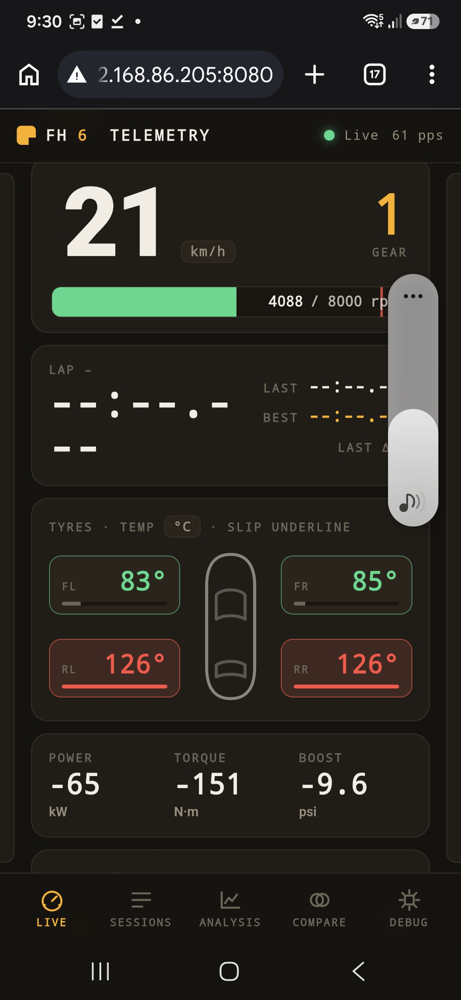
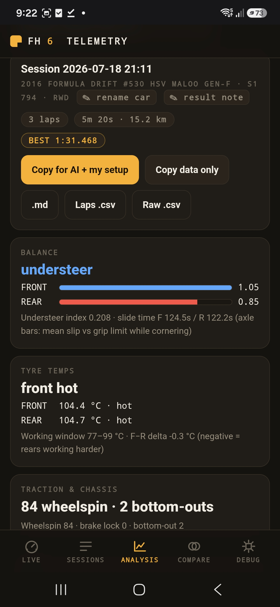
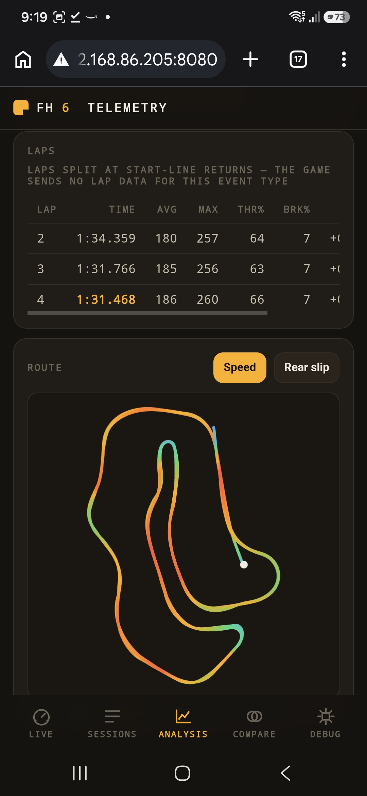
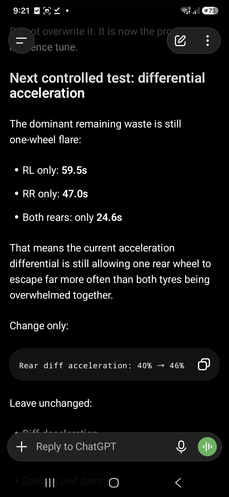
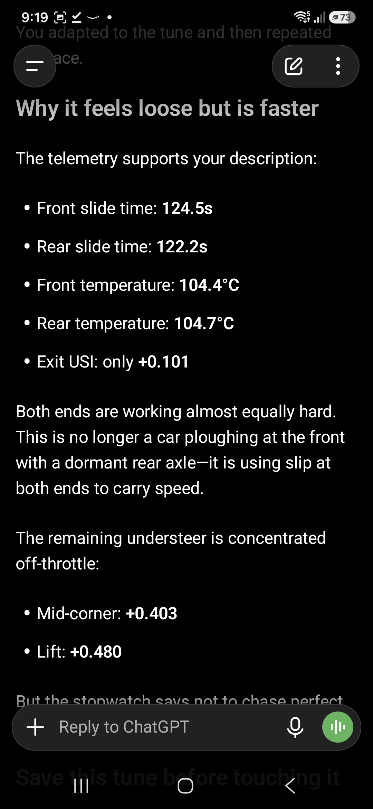

# Forza Horizon 6 Telemetry


Turn your phone into a **live pit instrument** for **Forza Horizon 6**, and
turn your laps into a **readable telemetry report**.

This is a free, open-source, self-hosted tool. It listens to the telemetry
Forza already broadcasts (the built-in **Data Out** feature), shows a live
dashboard on your phone, records every drive, and breaks each session into
**laps and corner-by-corner evidence** — throttle traces, entry/exit
speeds, slip by corner, tyre temps, wheelspin patterns, gearing. Everything
stays on your own Wi-Fi — **no cloud, no account, no subscription**.

> **This tool is not an AI, and it doesn't tune your car.** It's a
> telemetry analyser that produces a report *you read yourself* —
> [here's a real one](docs/example-report.md). It never invents setup
> values. It's a **companion to** an AI, not a replacement for you: if you
> want, you can paste the report into Claude or ChatGPT to help interpret
> it (that's an optional, separate step you choose to do), but the numbers,
> the comparisons and the decisions are all yours. Prefer to skip the AI
> entirely? Just read the report.

| Live · on the phone | Session analysis | Laps & route |
| --- | --- | --- |
|  |  |  |

*Real screenshots from a phone on the sofa — a Formula Drift ute being
tuned into a circuit racer (rears cooked at 126 °C mid-lap), and a 3-lap
race the game sent no lap data for, timed anyway by detecting start-line
returns.*

The live view is built like an instrument, not a website: huge numerals that
never shift layout, tyre pods coloured by the **temperature window** (blue
cold → green in-window → amber hot → red over), and **pedal ribbons on the
screen edges** — brake left, throttle right — readable in peripheral vision
while you drive.

---

## Get started (Windows, 5 minutes)

**[⬇️ Download fh6-telemetry.exe](https://github.com/ClickClickMedia/Forza-6-telemetry/releases/latest/download/fh6-telemetry.exe)** — one file, no install.

1. **Put the exe in its own folder** (e.g. `Documents\FH6`) and
   **double-click it**. Your recordings will be saved to a `data\` folder
   next to it.
   - Windows may show *"Windows protected your PC"* because the app isn't
     code-signed — click **More info → Run anyway**. (It's open source; you
     can read every line in this repo.)
   - If Windows shows a **firewall prompt**, tick **Private networks** and
     click **Allow access**.
2. A console window opens and prints your addresses, for example:

   ```
   Dashboard (phone)   : http://192.168.1.50:8080
   Forza Data Out      : send UDP to 192.168.1.50 : 9876
   ```

3. **In Forza Horizon 6**, go to **Settings → HUD and Gameplay** and scroll
   to the **Data Out** section:
   - **Data Out** → **ON**
   - **Data Out IP Address** → the IP the console printed (e.g. `192.168.1.50`)
   - **Data Out IP Port** → `9876`
4. **Drive.** On your phone (same Wi-Fi), open the dashboard address from
   step 2 and use your browser's **"Add to Home Screen"** to install it as
   an app. Rotate to landscape for the mounted-instrument view.
5. **To stop**, close the console window. Your recordings stay in `data\`.

> **Want to see it working before launching the game?** Open PowerShell in
> the exe's folder and run:
> ```powershell
> $env:FH6_SYNTHETIC = "1"; .\fh6-telemetry.exe
> ```
> A simulated car drives the dashboard. Close it and double-click normally
> when you're ready for real telemetry.

**Already use SimHub or another telemetry tool?** Forza only allows one
Data Out target — point the game at this app, then open **Debug → Forward
packets** and mirror the raw stream to your other tool's `ip:port`. Both
get identical 60 Hz data; nobody has to choose.

**Linux, home server, or prefer containers?** → [docs/DOCKER.md](docs/DOCKER.md)

---

## Read your data — and optionally hand it to an AI

The point of collecting all this data: understanding *where* you're losing
time, and getting concrete setup changes out of it. **The tool does the
first part — a readable evidence report. An AI is an optional second step
for the second part; the tool itself never tunes your car or invents
setting values.**

1. **Drive.** Recording is **manual by default** — press **● Record** on
   the Live page when you want data (it still auto-stops after 30 s
   stationary as a walk-away net). Prefer hands-off? Flip **Auto record**
   to *Events* (arms when you stage at a start line or lap timing goes
   live, ends with the event) or *Any driving*. **Free-roam time attacks
   are fully supported** — the app recognises the staged start-line
   signature and times your runs.
2. **Read the report** on the Analysis page — laps, corner-by-corner
   section evidence, balance, tyres, traction, suspension, gearing. That's
   often enough on its own to see where the car is losing time.
   ([here's a real one](docs/example-report.md).)
3. **Optionally, copy it into an AI** to help interpret. Pick your intent:
   - **⚡ Quick analysis** — one tap, no setup needed. Copies the full
     evidence packet with a prompt asking the AI to locate the problem and
     name setup *areas* to investigate. Good for "why was I slow?" after a
     random race.
   - **Engineering brief** — includes your saved tune (stored per car,
     last version pre-loaded, edit the one or two values you changed) plus
     the **changes since the previous revision**, discipline and assists.
   This is a **separate step you choose to do** — the copy lands on your
   clipboard, and *you* paste it into Claude or ChatGPT. No AI runs inside
   the tool. Whatever an AI then suggests is on you to judge; it can spit
   nonsense values, so the report keeps the numbers and the decision yours.
4. **Apply any changes yourself**, drive again, and **Compare** — the tool
   confirms whether the route matched and shows the before/after.

### The loop in action

Real ChatGPT replies from one evening spent turning a RWD Formula Drift
ute into a circuit racer, with reports copied straight out of this app:

| One precise change per test | Honest about what "worse" means |
| --- | --- |
|  |  |

The left reply reads the report's **per-wheel wheelspin split** (RL-only
59.5 s vs RR-only 47.0 s vs both-rears 24.6 s — one wheel flaring, not the
axle overwhelmed) and proposes exactly one change to test. The right one
uses **slide times, axle temperatures and corner-phase balance** to explain
why a tune that *feels* looser is genuinely faster — and tells the driver
to keep it. That's the level of reasoning the export's labelled,
provenance-marked data makes possible.

The verdicts (understeer/oversteer, temperature window) are computed from
grip-driving frames only — sustained drifting and opposite-lock moments are
excluded and reported separately, so a skid-pan session doesn't read as
"understeer". The tyre window is community-calibrated (optimal 88–99 °C,
usable 77–121 °C). Thresholds live in [`app/laps.py`](app/laps.py) as
documented constants; calibration PRs welcome.

**What this tool won't pretend to know:** Forza's Data Out carries no tyre
pressures and a single temperature per tyre (the inner/middle/outer readout
is the in-game HUD only — it is not in the UDP stream). Verdicts here use
only channels that actually exist; pressure and camber advice comes from the
setup values you fill into the report.

> **Power user?** Claude Desktop / Claude Code can also query your sessions
> directly instead of copy-paste — see
> [docs/CLAUDE-MCP.md](docs/CLAUDE-MCP.md). Entirely optional.

### Telemetry quirks worth knowing

- **Lap fields populate only in timed events** (races, Rivals, Time Trial).
  Free-roam time attacks send no lap data at all — but the app detects
  their runs anyway from `DistanceTraveled` (staged negative behind the
  line → crosses 0 at launch → snap-reset on exit). Plain cruising shows
  as one "stint".
- **Time Trial reports no `RacePosition`** — sessions key off `IsRaceOn`
  and the lap clock, never position.
- **Rewinds don't rewind telemetry**: the stream keeps flowing and your
  pre-rewind laps stay in the data; the analyser tolerates the time
  discontinuity.
- **Xbox sleep or app-switching kills Data Out** and it won't resume until
  Forza is restarted — if the packet rate drops to 0 mid-session, that's
  usually why.

---

## Features

- **Live pit instrument** — installable PWA with portrait, landscape-mount
  and desktop layouts, auto-reconnecting WebSocket, Wake Lock. Built for
  glanceability: fixed-width tabular numerals (zero layout shift),
  per-channel smoothing on noisy values, a drift-corrected lap clock, and
  pedal ribbons on the screen edges. Respects `prefers-reduced-motion`.
- **Recording, three modes** (switchable on the Live page, remembered):
  **Manual** (default) records only when you press ● Record — nothing is
  written until you ask; **Auto: events** records when a timed event
  begins — staged at a start line or lap timing live — and ends with the
  event; **Auto: any driving** records whenever you move. Every session
  closes after 30 s stationary or in menus (staging at a line doesn't
  count); ■ Stop is always instant. Raw frames stored as portable CSV;
  metadata in SQLite. Rename, annotate, name your cars, download — all
  from the phone.
- **Laps & tuning stats** — per-lap tyre temps (°C) and front/rear balance,
  a drift-aware understeer index, per-axle slide times, wheelspin and
  brake-lock events, suspension travel and bottom-outs, shift RPM and
  time-on-limiter.
- **Corner-by-corner section evidence** — every cornering event classified
  by shape (hairpin, turn, sweeper, chicane/transfer, straight, launch)
  with entry/min/exit speeds, slip, throttle-reapplication and wheelspin
  per section, and representative samples timestamped so you can find them
  in the data. Session-wide averages hide where the car actually struggles;
  this doesn't.
- **Readable evidence report** — a Markdown report you read yourself
  ([example](docs/example-report.md)), or optionally paste into an AI. Copy
  it four ways: **Quick analysis** (no setup), **Engineering brief** (with
  your saved tune + changes since last revision), **Copy evidence** (no
  prompt), or **Export files** — report, per-lap CSV, `sections.json`, raw
  CSV, or a complete `.zip` package. Optional direct Claude connection over
  MCP ([docs/CLAUDE-MCP.md](docs/CLAUDE-MCP.md)).
- **Honest before/after comparison** — each session is compared against the
  last run of the same car, but **only when the tool can confirm the route
  matches** (timed-loop length within 5%); otherwise it says so rather than
  showing a misleading delta. Lap validity (valid / partial / rewind-
  affected) is flagged, and rewind-affected laps are kept out of your best.
- **Analysis & comparison** — verdict cards, route trace coloured by speed
  or rear slip, gear usage, event detection; two-session channel overlay.
- **Solid plumbing** — asyncio UDP receiver that never crashes on malformed
  input, `/health` + `/api/status`, structured logging, graceful shutdown, a
  packet-debug page with a live physics cross-check, automatic **v1.0.x
  recording rescue**, and a synthetic generator so you can try everything
  without the game.

---

## The FH6 packet (324 bytes)

**Forza Horizon 6 emits the same 324-byte "Horizon" packet as FH4/FH5** —
confirmed empirically against live game captures, not assumed. Every offset is
covered by unit tests ([`tests/test_packet.py`](tests/test_packet.py)):

| Property | FM7 "Dash" | Forza Motorsport (2023) | **FH4 / FH5 / FH6 (this app)** |
| --- | --- | --- | --- |
| Packet size | 311 | 331 | **324** |
| `TireWear` (4×f32) | absent | present | **absent** |
| `TrackOrdinal` (s32) | absent | present | **absent** |
| Horizon 12-byte block after `NumCylinders` | absent | absent | **present** |

The Horizon layout is the FM7 structure with two additions:

- **12 bytes inserted at offsets 232–243** (between `NumCylinders` and
  `PositionX`): the officially documented FH6 fields `CarGroup` (s32, a
  stable per-car category value), `SmashableVelDiff` and `SmashableMass`
  (f32 impact metadata, 0.0 outside collisions). Most FH5-era parsers still
  label these bytes "unknown".
- **1 trailing byte at offset 323** (`Unknown3`, always observed 0).

So: **232-byte sled + 12-byte Horizon block + 79-byte dash tail (at 244) +
1 trailing byte = 324**. See the module docstring in
[`app/packet.py`](app/packet.py) for the authoritative field table and the
full validation story.

Wire units worth knowing: `Speed` m/s · `Power` watts · `TireTemp*`
**Fahrenheit** (the dashboard converts to °C) · `Boost` PSI · lap times
seconds. All scalars are decoded **little-endian**, validated by round-trip
and explicit endianness unit tests.

The strongest validation is physics, not vibes: the dash `Speed` field must
equal the sled `|VelocityX,Y,Z|` magnitude on every moving frame — a
one-byte layout error breaks that instantly. The **`/debug`** page shows
this cross-check live; if it ever fails on your setup,
[open an issue](../../issues/new/choose) with a screenshot.

> **Recorded sessions with v1.0.0?** v1.0.x used a mis-specified layout that
> corrupted the dash-tail columns (speed, temps, laps, inputs) in
> recordings. This version detects those files at startup and **rescues
> them automatically** — losslessly re-decoding the original bytes
> (originals kept as `*.v1bak`) and validating every frame with the same
> physics cross-check. Or run it manually:
> `python -m app.rescue --data-dir ./data`.

---

## Pages & API

| Path | Purpose |
| --- | --- |
| `/` | Live dashboard |
| `/sessions` | Session list, rename, notes, exports, delete |
| `/analysis?session=ID` | Verdicts, laps, route trace, per-session analysis |
| `/compare` | Two-session comparison + overlaid route |
| `/debug` | Live parsed packet field table + physics check |

| Method | Path | Purpose |
| --- | --- | --- |
| GET | `/health` | Liveness + basic config |
| GET | `/api/status` | Receiver stats, recording state |
| WS | `/ws/live` | Live telemetry (~18 Hz JSON frames) |
| GET | `/api/sessions` | List sessions |
| GET | `/api/sessions/{id}` | Session detail + markers |
| PATCH | `/api/sessions/{id}` | Rename / edit notes |
| DELETE | `/api/sessions/{id}` | Delete session + raw file |
| GET | `/api/sessions/{id}/analysis` | Full analysis |
| GET | `/api/sessions/{id}/laps` | Lap breakdown + tuning aggregates + verdicts |
| GET | `/api/sessions/{id}/tuning.md` | Evidence report (`?mode=quick\|data`, `?style=compact`, `?setup_id=N`, `?download=1`) |
| GET | `/api/sessions/{id}/sections.json` | Structured corner-section evidence |
| GET | `/api/sessions/{id}/package.zip` | Full session bundle (report, CSVs, sections, metadata, setup) |
| GET | `/api/sessions/{id}/laps.csv` | Per-lap summary CSV |
| GET | `/api/sessions/{id}/route?colour_by=speed\|rear_slip` | Route trace |
| GET | `/api/sessions/{id}/download.csv` | Raw frames CSV |
| DELETE | `/api/sessions` | Delete all sessions (keeps cars/setups/settings) |
| POST | `/api/recording/start` \| `/stop` \| `/marker` | Manual recording control |
| GET | `/api/compare?a=ID&b=ID&colour_by=...` | Compare two sessions |
| GET | `/api/debug/last` \| `/api/debug/spec` | Packet debug |

## Configuration

All configuration is via environment variables:

| Variable | Default | Description |
| --- | --- | --- |
| `FH6_UDP_HOST` | `0.0.0.0` | UDP bind address |
| `FH6_UDP_PORT` | `9876` | UDP telemetry port |
| `FH6_FORWARD` | *(off)* | Mirror raw packets to `ip:port` (SimHub etc.); also settable on `/debug` |
| `FH6_HTTP_HOST` | `0.0.0.0` | Dashboard bind address |
| `FH6_HTTP_PORT` | `8080` | Dashboard/API port |
| `FH6_PUSH_HZ` | `18` | Browser live-update rate (Hz) |
| `FH6_SESSION_IDLE_TIMEOUT` | `30` | Auto-end session after N s of stream silence (menus) |
| `FH6_RECORD_MODE` | `manual` | Initial auto-record mode: `manual` / `event` / `motion` (UI setting overrides) |
| `FH6_STATIONARY_TIMEOUT` | `30` | Auto-end any session after N s stationary (staging exempt) |
| `FH6_KEEP_MIN_S` | `5` | Discard auto-recorded sessions shorter than this |
| `FH6_MAX_DATA_MB` | `0` (off) | Optional cap: prune oldest disposable sessions past this size |
| `FH6_RAW_FORMAT` | `csv` | Raw storage: `csv` (or `parquet`, Docker only) |
| `FH6_DATA_DIR` | next to exe / `./data` | Data directory (SQLite + raw files) |
| `FH6_SYNTHETIC` | `0` | `1` to enable the synthetic generator |
| `FH6_LOG_JSON` | exe: `0` · other: `1` | `1` = JSON logs, `0` = human-readable console |
| `FH6_LOG_LEVEL` | `INFO` | Log level |

### Data layout

```
data/
  sessions.db                  SQLite: session metadata + markers + car names
  sessions/
    session_000001.csv         raw frames (t_mono, t_wall, + all 89 FH6 fields)
```

Raw files are portable CSV — open them in Excel, pandas, or any tool.

### Your disk, respected

Everything this app stores lives in that **one visible `data\` folder** next
to the exe — no AppData, no registry, no log files, no services, no cloud.
Uninstalling is deleting the folder.

What to expect and the safeguards in place:

- Raw 60 Hz telemetry is ~**250 MB per hour of driving**. The Sessions page
  shows each session's size and the folder total, so growth is never
  invisible.
- **Blip sessions are discarded automatically** (auto-recordings under 5 s —
  rolling out of a menu, a stationary timeout) so junk doesn't accumulate.
- Deleting a session in the UI deletes its raw file too.
- Want a hard ceiling? Set `FH6_MAX_DATA_MB` (e.g. `4000`) and the oldest
  *auto-recorded, un-renamed, un-annotated* sessions are pruned after each
  session closes. Renamed or annotated sessions are never touched, and the
  cap is **off by default** — nothing is ever deleted without you opting in.
- The exe unpacks itself to `%TEMP%` while running (normal for one-file
  apps) and cleans up on exit; if Windows kills it mid-run, the next launch
  removes any of its own stale leftovers older than 48 h.

## Troubleshooting

- **Packet rate stays 0 with Data Out on** → wrong IP in the game's Data Out
  settings, a missing firewall rule, or a guest Wi-Fi with "AP isolation".
  Everything must be on the same normal network. To open the ports manually
  (PowerShell as Administrator):

  ```powershell
  New-NetFirewallRule -DisplayName "FH6 Telemetry UDP" -Direction Inbound -Protocol UDP -LocalPort 9876 -Action Allow
  New-NetFirewallRule -DisplayName "FH6 Dashboard TCP" -Direction Inbound -Protocol TCP -LocalPort 8080 -Action Allow
  ```

- **Phone can't load the dashboard** → use the PC's LAN IP (printed in the
  console), not `localhost`, and check the TCP rule above.
- **Values look wrong** → open `/debug` and check the **Speed vs |V|**
  physics indicator; if it fails, screenshot and open an issue.
- **Stream goes silent mid-session** → Xbox sleep or app-switching stops
  Data Out until Forza is restarted (see quirks above).
- **"Windows protected your PC" / antivirus flags the exe** → the build is
  an unsigned open-source executable (code-signing certificates cost money
  this free tool doesn't have), and one-file Python apps are a common
  false-positive pattern. You can verify your download: run
  `Get-FileHash fh6-telemetry.exe` in PowerShell and compare it to the
  **SHA-256** printed in the release notes — or skip the exe entirely and
  run from [Docker](docs/DOCKER.md) or source.

## Development

```bash
python -m venv .venv && source .venv/bin/activate
pip install -r requirements-dev.txt
pytest                                   # packet offsets, rescue, laps, MCP

# Run locally with the synthetic generator:
FH6_SYNTHETIC=1 uvicorn app.main:app --host 0.0.0.0 --port 8080
```

Project layout, packet-validation workflow and conventions:
[CONTRIBUTING.md](CONTRIBUTING.md).

## Security & scope

This is a **LAN tool with no authentication** — anyone who can reach port
8080 can view the dashboard and manage recordings. That's fine on a home
network, but:

- **Do not expose ports 8080/9876 to the internet** (no port-forwarding, no
  public reverse proxy). Keep it on your local Wi-Fi/LAN.
- The UDP receiver accepts telemetry from any source on the network; it only
  ever *reads* 324-byte packets and never executes anything from them.
- All data stays local — recordings live in `./data` on your machine.
  There is no telemetry or analytics anywhere in this project, and the
  **only network request it can ever make** is the user-initiated "Check
  for updates" button on the Debug page (one query to GitHub's public
  releases API, only when you click it).

## Contributing

Contributions welcome — especially **real-game packet captures** and tuning
threshold calibration. See [CONTRIBUTING.md](CONTRIBUTING.md); bug reports
and packet-mismatch reports have [issue templates](.github/ISSUE_TEMPLATE).

## License

Released under the [MIT License](LICENSE) © 2026 ClickClickMedia — free to
use, modify, and share.

Not affiliated with, endorsed by, or sponsored by Microsoft, Turn 10
Studios, or Playground Games. "Forza" and "Forza Horizon" are trademarks of
Microsoft. This project reads only the telemetry the game voluntarily
broadcasts via its built-in **Data Out** feature; it contains no game code
or assets.
